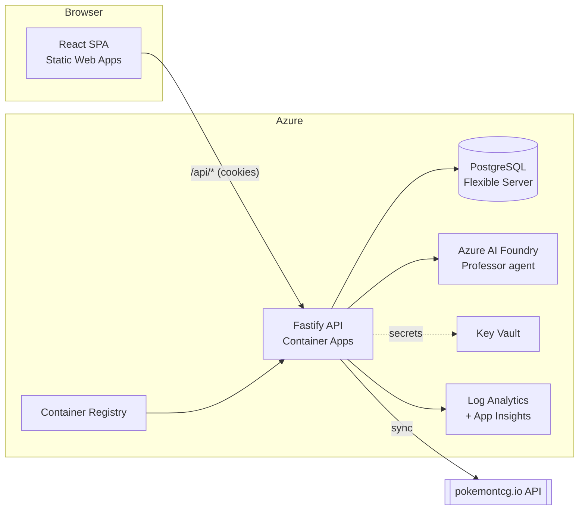

# Pokedeck — Architecture

## System overview

## Request flow

1. The SPA calls the API under `/api/*` with `credentials: 'include'` (session cookie).
2. **Auth.js** (mounted at `/api/auth/*`) handles SSO sign-in and issues a database session.
   Protected routes call `requireUser()` which validates the session cookie.
3. Card/collection/deck routes read/write Postgres via Drizzle.
4. **Deck grading** (`POST /api/decks/:id/analyze`) computes deterministic metrics, then — if
   Foundry is configured — asks the Professor agent to enrich them with narrative and
   recommendations. The full analysis is persisted to `deck_analyses`.
5. **Deck coach** (`POST /api/coach`) holds a conversation, mapped to a Foundry thread and
   mirrored into `coach_threads`/`coach_messages`.

## Design principles

- **Graceful degradation.** No Azure? The app still runs: Foundry calls fall back to the
  heuristic analyzer (`services/deck-metrics.ts`), so local dev needs only Node + Postgres.
- **Reference data is cached, not owned.** Cards/sets mirror pokemontcg.io; the raw payload is
  retained so we can re-normalize without re-fetching.
- **Passwordless everywhere in Azure.** The Container App uses a managed identity for ACR pull,
  Key Vault, and Foundry. CI/CD uses OIDC federated credentials — no stored cloud passwords.
- **The API contract is a package.** `@pokedeck/shared` is the single source of truth for DTOs,
  imported by both web and API, so the two never drift.

## Foundry integration

The "Professor" is an Azure AI Foundry agent. `services/foundry.ts` lazily constructs an
`AIProjectClient` with `DefaultAzureCredential` (managed identity in Azure, `az login` locally)
and exposes a `complete(system, user)` surface. `services/deck-coach.ts` owns the prompts and
JSON contracts for grading and chat. Swapping to the full Foundry Agent Service (persistent
agents + tools) is isolated to `foundry.ts`.

## Security

- Sessions are httpOnly cookies (Auth.js database strategy).
- CORS is locked to `WEB_ORIGIN`.
- Secrets (DB password, `AUTH_SECRET`, OAuth secrets, Foundry config) live in Key Vault and are
  surfaced to the Container App as secret references — never in source or image.
- Postgres requires SSL and Entra auth is enabled.

## Environments

Single Bicep template parameterized by `environmentName` (`dev`, `prod`). Promotion is
trunk-based: PR → `main` → `infra-cd` (if infra changed) → `app-cd` (build image, migrate DB,
roll Container App + deploy SWA). See [alm.md](alm.md).
