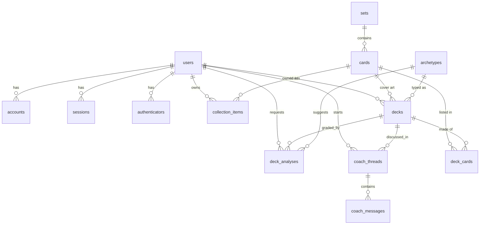

# Pokedeck — Data Model

PostgreSQL (Azure Database for PostgreSQL Flexible Server). Schema authored in
[Drizzle ORM](https://orm.drizzle.team) — see [`apps/api/src/db/schema.ts`](../apps/api/src/db/schema.ts).
Migrations are generated with `npm run db:generate` and applied with `npm run db:migrate`.

## Design goals

1. **Own only what we must.** Card/set metadata is reference data owned by
   [pokemontcg.io](https://pokemontcg.io). We cache it locally (so decks/collections can
   foreign-key to it and so we can query fast) but treat it as replaceable — the full raw API
   payload is kept in a `raw` JSONB column so we never lose fidelity to what we chose to normalize.
2. **A deck is a list of card references + counts.** Never copy card attributes into a deck.
3. **AI output is data, not a side effect.** Every deck analysis and coach conversation is
   persisted and versioned, so we can show history, compare, and improve prompts against real runs.
4. **Auth is standard.** The `auth_*`-shaped tables match the Auth.js (NextAuth) Drizzle adapter
   contract exactly, so self-hosted SSO "just works" and stays upgradeable.

## Entity groups

| Group | Tables | Purpose |
|-------|--------|---------|
| **Identity** | `users`, `accounts`, `sessions`, `verification_tokens`, `authenticators` | Auth.js self-hosted SSO (Microsoft/Google/GitHub) + optional passkeys |
| **Card reference** | `sets`, `cards` | Cached, normalized mirror of the Pokémon TCG API |
| **Collection** | `collection_items` | The cards a user *owns* (with quantity) |
| **Decks** | `decks`, `deck_cards` | User-built decks and their 60-card lists |
| **Strategy** | `archetypes` | Curated + AI-known deck archetypes/strategies |
| **AI** | `deck_analyses`, `coach_threads`, `coach_messages` | Persisted Foundry agent output & conversations |
| **Ops** | `card_sync_runs` | Bookkeeping for the card-data sync job |

## ERD

## Key tables

### `sets`
Card set metadata (`sv1`, `base1`, …). PK is the pokemontcg.io set id (text).

### `cards`
One row per printed card. PK is the pokemontcg.io card id (text, e.g. `sv1-1`).
Normalized columns for the fields we filter/sort on (`name`, `supertype`, `types`, `hp`,
`rarity`, `regulation_mark`, `national_pokedex_numbers`, `subtypes`), structured game data as
JSONB (`abilities`, `attacks`, `weaknesses`, `resistances`, `legalities`), and the untouched API
response in `raw`. GIN indexes on the array columns power "cards of type Fire" style queries.

### `collection_items`
`(user_id, card_id)` unique — a user owns *N* copies of a card. This is the pool the AI draws
from when it recommends "cards you already own that belong in this deck."

### `decks` / `deck_cards`
A deck references cards by id with a `quantity` and `zone` (`main` today; room for `sideboard`
in future formats). Application logic enforces format rules (Standard = 60 cards, ≤4 of any card
by name except basic Energy). `primary_types` and `archetype_id` are denormalized hints the UI
and AI use for fast grouping.

### `archetypes`
Curated and AI-known strategies (Charizard ex control, Lost Zone toolbox, Lugia Archeps, …) with
`playstyle`, `key_card_ids`, and `signature_pokedex_numbers`. Used to (a) classify a deck and
(b) tell a user which staple cards for a strategy they're missing.

### `deck_analyses`
An immutable record of one Foundry agent grading. `overall_score` (0–100) plus a `scores` JSONB
breakdown (consistency, energy balance, type coverage, speed, resilience, tech flexibility),
human-readable `strengths`/`weaknesses`, structured `recommendations` and `missing_cards`, a
`suggested_archetype_id`, and the raw agent payload + `foundry_run_id` for traceability.

### `coach_threads` / `coach_messages`
A conversation with the deck-coach agent, mapped to a Foundry Agent Service `thread` via
`foundry_thread_id`. Messages mirror the Foundry thread so the UI can render history without a
round-trip.

## Enumerations

- `card_supertype`: `Pokémon` · `Trainer` · `Energy`
- `deck_format`: `standard` · `expanded` · `unlimited` · `glc`
- `deck_zone`: `main` · `sideboard`
- `playstyle`: `aggro` · `control` · `combo` · `midrange` · `mill` · `toolbox` · `stall`
- `coach_role`: `user` · `assistant` · `system` · `tool`
- `sync_status`: `running` · `succeeded` · `failed`

## Conventions

- UUID v4 primary keys for app-owned rows (`gen_random_uuid()`), text PKs for external ids.
- `created_at` / `updated_at` (`timestamptz`) on all mutable app tables; `updated_at` bumped by app.
- All FKs to `users` and `decks` cascade on delete (deleting a user/deck removes their data).
- FKs to `cards`/`sets`/`archetypes` restrict on delete (reference data isn't deleted casually).
